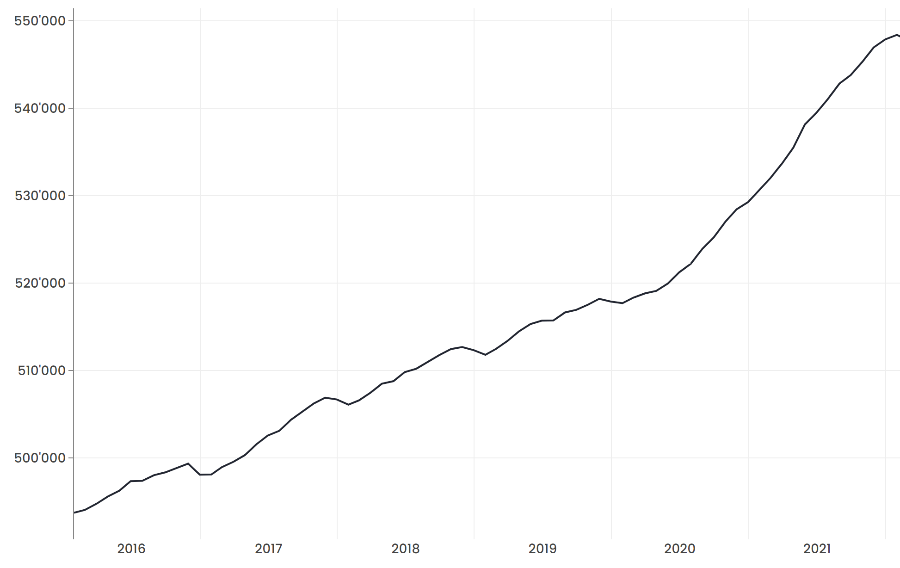

# Projekt Skizze
- [Ausgangslage](#ausgangslage)
- [Idee von Ikitomo](#idee-von-ikitomo)
- [Kundennutzen](#kundennutzen)
- [Konkurrenzanalyse und Abgrenzung zu Bestehendem](#konkurrenzanalyse-und-abgrenzung-zu-bestehendem)
- [Hauptablauf](#hauptablauf)
  - [Inhalt des Prototyps](#inhalt-des-prototyps)
  - [Anwendungsbeispiel](#anwendungsbeispiel)
- [Weitere Anforderungen](#weitere-anforderungen)
  - [Funktionale Anforderungen](#funktionale-anforderungen)
  - [Nicht-Funktionale Anforderung](#nicht-funktionale-anforderung)
- [Ressourcen](#ressourcen)
- [Risiken](#risiken)
- [Wirtschaftlichkeit](#wirtschaftlichkeit)
- [Bibliographie](#bibliographie)

## Ausgangslage
Gerade in den Zeiten der Corona-Pandemie sehnen sich wohl viele Leute nach einem eigenen Haustier,
was sich schon alleine anhand der erhöhten Nachfrage nach Hauskatzen und Hunden feststellen lässt. Dies kann auch in der Grafik unten beobachtet werden.

_Statistik über die Anzahl registrierter Hunde in der Schweiz [1]_

Leider haben nicht alle Personen die finanzielle Möglichkeit,
für die Pflege, das Futter und die tierärztliche Behandlung eines Haustiers aufzukommen.

Es besteht also ein erhöhter Bedarf zu kostengünstiger Haustierhaltung.

## Idee von Ikitomo
Ikitomo will genau diesen Bedarf decken, indem es die Möglichkeit bereitstellt,
eine breite Auswahl von Haustieren auf den eigenen Bildschirm einzuladen.
Diese virtuellen Haustiere sollen es sich auf dem Bildschirm gemütlich machen, ab und zu den Mauszeiger verfolgen, schlafen und für Unterhaltung sorgen.

Haustiere sollen hierbei so natürlich wie möglich agieren.
So sind zum Beispiel Katzen mit den klassischen "Schläft durchgehend", "Braucht jetzt Aufmerksamkeit" und "Katz- und Maus-Spiel" Modi ausgestattet.

Haustiere bewegen sich frei auf dem Bildschirm, interagieren mit Nutzerinen und Nutzern,
zeigen Wertschätzung, Freude, Hass und weitere Emotionen auf nachvollziehbarer Weise.
Zusätzlich soll über eine Online-Plattform Tauschhandel möglich sein,
um neue Kostüme, Spezies, Verhaltensweisen und weiteres erleben zu können.

## Kundennutzen
Wie auch bereits Tamagotchis, soll Ikitomo den Nutzern und Nutzerinnen ein Haustier verleihen. Das *Tomodachi*, ein virtuelles Haustier, soll mit den Nutzern und Nutzerinnen interagieren, ohne dabei nervend zu werden.
Dies soll den Nutzerinnen und Nutzern regelmässig ein Lächeln auf das Gesicht zaubern. Da das *Tomodachi* einen gewissen Pflegeaufwand mit sich bringt, sollen sich die Nutzerinnen und Nutzer emotional an ihr *Tomodachi* binden und eine Beziehung mit ihrem Freund auf dem Bildschirm aufbauen, sei dies eine Katze, ein Hund oder ein anderes Tier.

Für das *Tomodachi* soll ein kleines Zuhause gebaut werden können. Die Nutzer und Nutzerinnen können sich dabei kreativ ausleben und können danach zusehen, wie ihr *Tomodachi* in seinen neuen 
vier Wänden spielt oder schläft. 

Ikitomo soll viele Konfigurationsmöglichkeiten besitzen, damit das *Tomodachi* und sein Verhalten so angepasst werden kann, dass es die Nutzerinnen und Nutzer unterhält und ihnen Spass
bringt.

Wenn die Nutzer und Nutzerinnen die App heruntergeladen haben, kann ihr *Tomodachi* sie zusätzlich überallhin begleiten und ihnen so immer emotionalen Support leisten.

## Konkurrenzanalyse und Abgrenzung zu Bestehendem
Es gibt einige Programme, in welchen ein animiertes Tier oder eine Figur dem Mauszeiger folgen oder alternativ auch zum aktiven Fenster laufen kann.
Das bekannteste davon ist Oneko, welches Open-Source ist und kostenlos auf Unix Betriebssystemen installiert werden kann [2]. Es gibt mehrere Windows Ports, kostenlose wie auch kostenpflichtige.
Eine weitere Applikation ist Desktop Goose, welche eine Gans auf dem Desktop anzeigt, welche den Nutzer so effektiv wie möglich nervt [3] oder eSheep, die nach einer Windows-Alternative aussieht[4].

Keine der oben genannten Projekte hat den geplanten Umfang. Zudem sind die genannten Beispiele alle Fan-Projekte, welche nicht kommerzialisiert sind. Unsere Software
soll eine höhere Qualität aufweisen. Sie soll auch mehr Funktionen implementieren, wie das Bauen von einem Zuhause für das *Tomodachi* oder 
eine App, welche sich mit dem Desktop Client synchronisiert, sodass die Nutzer und Nutzerinnen nie ihr *Tomodachi* auf dem Rechner zurücklassen müssen. All dies
soll dazu führen, dass Ikitomo mehr als nur eine Software ist, sondern ein Schlüssel zum Schliessen einer Freundschaft mit seinen *Tomodachi*s. 

Um Nutzerinnen und Nutzer über eine lange Zeit hinweg zu fesseln, können über einen Online-Shop Erweiterungen gekauft werden, um neue Inhalte wie neue *Tomodachi*s, Gebäude oder Mini-Spiele freischalten zu können.

## Hauptablauf
*Ikitomo* als Ganzes besteht aus zwei Komponenten, welche in weitere Unterkomponenten aufgeteilt sind. Die erste Komponente ist die *Ikitomo* Benutzerapplikation. Diese läuft lokal auf dem Gerät der Endbenutzerinnen und Endbenutzer. Es besteht aus dem *Tomodachi*, dem gewählten Tier der Benutzerin oder des Benutzers, und einer Konfigurationsschaltfläche, worin Benutzerinnen und Benutzer ihren *Tomodachi* nach Belieben konfigurieren können. Fortgeschrittene Benutzerinnen und Benutzer haben die Möglichkeit, direkt auf die Dateien des *Tomodachi*s zuzugreifen, um erweiterte Funktionalitäten zu kreieren.  
Die zweite Komponente ist die *Tomodachi Plaza*, ein digitaler Marktplatz, worin offizielle *Tomodachi*s verkauft werden und Benutzerinnen und Benutzer ihre eigenen *Tomodachi*s hochladen und teilen können. In der Plaza können Benutzerinnen und Benutzer auch ihre hochgeladenen *Tomodachi*s verwalten und organisieren. Für Administratoren und Administratorinnen gibt es einen exklusiven Bereich zur Moderation der Plattform.

### Inhalt des Prototyps
Selbstverständlich ist die Umsetzung eines Projekts dieser Grösser nicht trivial. Aus diesem Grund wird im Zeitraum vom 08.04.2022 bis zum 13.05.2022 Zeit investiert, um einen Prototyp von *Ikitomo* in Java zu entwickeln. Dieser Prototyp wird eine drastisch reduzierte Anzahl an Funktionalitäten bieten und dient zur Evaluation der Idee, in anderen Worten ein "Proof-of-Concept".  

Per dem erwähnten Enddatum werden die folgenden Voraussetzungen umgesetzt:  

- Offline-Version von *Ikitomo* auf Windows, Linux und macOS lauffähig
- Mindestens zwei *Tomodachi* mit unterschiedlichem Aussehen
  - Das *Tomodachi* soll hin und wieder dem Mauszeiger folgen
  - Bei einem Klick auf das *Tomodachi* soll es gefüttert werden
  - Das *Tomodachi* soll in zufälligen Zeitabständen schlafen gehen
- Speicherformat für Konfigurationen
- Management-GUI zur Anpassung der Konfigurationsdatei

Optionale Ziele:

- Veränderbares Verhalten
- Erkennen, welches Fenster im Fokus ist

### Anwendungsbeispiel
Mark verwendet nun seit einer Woche *Ikitomo* auf seinem Hauptgerät. Auch heute startet er seinen PC auf und *Ikitomo* startet automatisch mit. Nach ein paar Sekunden taucht eine kleine Katze auf Marks Bildschirm auf. Dies ist sein aktueller *Tomodachi*. Für eine kurze Weile beobachtet er wie die Katze seinem Mauszeiger folgt und beginnt anschliessend mit seiner Arbeit. Ihm fällt ein, dass er vergessen hat seinen *Tomodachi* zu füttern und klickt auf die Katze mit der rechten Maustaste. Eine kurze Animation wird abgespielt, worauf die Katze zum oberen Bildschirmrand geht und sich dort ausruht.  
Während der Mittagspause möchte Mark seinen *Tomodachi* austauschen. Er öffnet das Bedienfeld von *Ikitomo* und sieht sich die vorinstallierten *Tomodachi*s an. Jedoch gefällt ihm keine der Optionen und er navigiert über das Bedienfeld zum *Tomodachi Plaza*. Dort meldet er sich mit seinem Benutzerkonto an und sieht sich die beliebtesten *Tomodachi*s der Woche an. Mark findet einen Tiger *Tomodachi* und fügt ihn zu seinem Profil hinzu. *Ikitomo* lädt den neuen *Tomodachi* innert Sekunden herunter, welcher daraufhin in der Applikation angezeigt wird. Mark wählt den neuen *Tomodachi* aus und beobachtet das neue Verhalten. Der Tiger ist deutlich schneller als die Katze und das Futter sieht ebenfalls anders aus. Mark ist zufrieden mit dem Tiger und wendet sich wieder seiner Arbeit zu.

## Weitere Anforderungen
Um die Benutzererfahrung zu verbessern, fügen wir weitere Features hinzu, die sowohl für die Benutzer und Benutzerinnen als auch für die Entwicklung hilfreich sind. Diese Anforderungen betreffen nicht - beziehungsweise nur indirekt - die Hauptfunktion des Programmes.
Die Kategorien, in die diese unterteilt werden, sind in den folgenden Abschnitten beschrieben.

### Funktionale Anforderungen
Bei funktionalen Anforderungen handelt es sich um zusätzliche Features,
welche Funktionen für die Benutzer und die Benutzerinnen hinzufügen und somit von aussen klar ersichtlich sind.

Folgende funktionale Anforderungen sind im Folgenden aufgelistet:

- Bei einem Klick auf das *Tomodachi* soll eine Interaktion gestartet werden. Die Interaktionen sind verschieden und können unter Umständen zufällig ausgeführt werden. So könnte das *Tomodachi* beispielsweise ein Herz ausgeben oder sich hinlegen.
- Das *Tomodachi* ist per Drag-and-Drop verschiebbar, um so nicht die Interaktion der Benutzer und Benutzerinnen mit anderen Programmen zu beeinträchtigen.
- Es gibt ein Zuhause (bspw. ein Korb), in dem das *Tomodachi* schlafen kann.
  So können Benutzerinnen und Benutzer sich eine Auszeit von ihrem *Tomodachi* nehmen.

### Nicht-Funktionale Anforderung
Unter Nicht-Funktionalen Anforderungen werden hier Features verstanden, mit welchen Benutzer und Benutzerinnen nicht interagieren können.
Diese Features sind als Eigenschaften, wie bspw. dessen Geschwindigkeit, zu verstehen.

Folgende Nicht-Funktionale Anforderungen sollen umgesetzt werden:

- Die Software soll möglichst ressourceneffizient sein, damit der Benutzerinnen und Benutzer beim Interagieren von anderen Programmen so wenig wie möglich beeinträchtigt werden.
- Die Software soll skalierbar sein für zukünftige Features. Dies soll den zukünftigen Entwicklungsaufwand möglichst reduzieren.

## Ressourcen

| Komponente                           | Benötigtes Know-How                                                     | Geschätzter Aufwand |
| ------------------------------------ | ----------------------------------------------------------------------- | ------------------- |
| Benutzerapplikation                  | Plattformunabhängige Entwicklung, Dateiformate kreieren, Rudimentäre KI | 640 h               |
| *Tomodachi*s                         | Pixel-Art & Animation                                                   | 50 h                |
| *Tomodachi Plaza* Grundgerüst        | Datenbankmodell kreieren, Netzwerksicherheit, Hosting                   | 200 h               |
| *Tomodachi Plaza* Benutzeroberfläche | Webdesign, JavaScript, UX-Design                                        | 200 h               |
| **Total**                            |                                                                         | **1090 h**          |

## Risiken
Ein wichtiger Aspekt von *Ikitomo* ist die Art des Produktes. *Ikitomo* ist eine 
sogenannte "Virtual Pet" Applikation, welche in den 2000-er Jahren sehr beliebt waren 
aber wegen Marktübersättigung ausgestorben sind. *Ikitomo* versucht diesen Markt 
wiederzubeleben. Es ist durchaus möglich, dass *Ikitomo* nicht genug Aufsehen oder 
Onlinediskussion generiert, um relevant zu bleiben. Aus diesem Grund ist es notwendig, Social-Media intelligent anzuwenden, um *Ikitomo* ausserordentlich zu vermarkten.  
Ein weiterer Punkt ist das fehlende Know-How für das Erstellen von Animationen, für Netzwerksicherheit und
für Webdesign. Sollten diese Fähigkeiten und Know-How bis zum Projektstart nicht vorhanden sein, kommt
es zu Verschiebungen und Verzögerungen. Somit würden auch die Kosten steigen.

## Wirtschaftlichkeit
Für das Endprodukt schätzen wir einen Aufwand von 1'090 Stunden, für welchen mit einem
Stundenansatz von 90.- Fr. gerechnet wird. Somit werden dafür 98'100.- Fr. benötigt, um das Produkt zu verwirklichen.
Zu diesen Kosten kommen zusätzlich wiederkehrende Kosten für die Server-Infrastruktur, für welche wir mit 5000.- Fr.
pro Jahr rechnen.

Die Haupteinnahmequelle werden verkaufte *Tomodachi*s und weitere Accessoires vom *Ikitomo Plaza* sein. 
Ein *Tomodachi* wird 5.- kosten, Accessoires zwischen 1.- Fr. und 15.- Fr. entsprechend der Grösse, Interaktivität und Besonderheit dieser Objekte. Wir erwarten innert 2 Jahren 100'000 Nutzer, wovon voraussichtlich 30% mindestens drei Käufe im *Ikitomo Plaza* getätigt werden haben und somit über diese zwei Jahre 630'000.- Fr. einbringen werden.

## Bibliographie
[1]: "Entwicklung in der Schweiz" Statistik aus identitas' Datenbank <https://tierstatistik.identitas.ch/de/fig-dogs-CH.html> 
[2]: "oneko-1.3", <http://www.daidouji.com/oneko/> (Zugegriffen: 30.03.2022) 
[3]: "Desktop Goose by samperson", <https://samperson.itch.io/desktop-goose> (Zugegriffen: 30.03.2022) 
[4]: "Desktop Pet (eSheep 64bit) | Add a screen mate to your desktop", <https://adrianotiger.github.io/desktopPet/> (Zugegriffen: 30.03.2022)