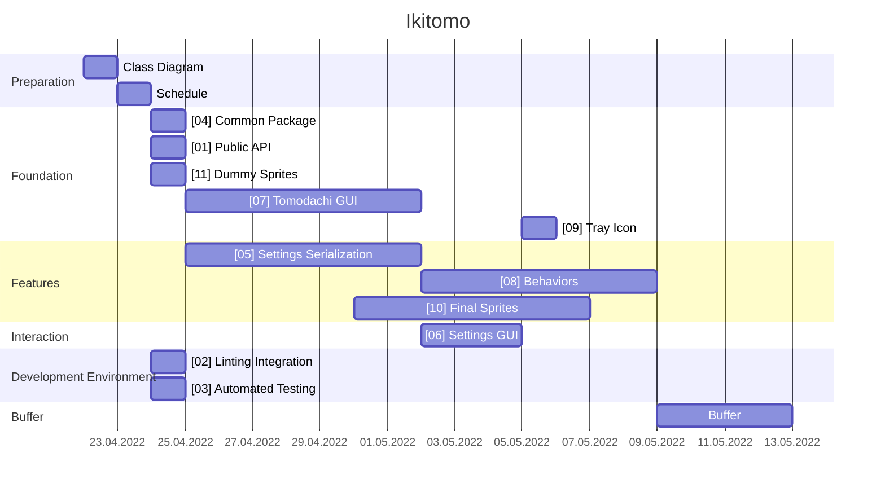

# Schedule

## Responsibilities
  - Class Diagram: @zumbrseb
  - Schedule: @costajon, @thalmma5, @zieglmic, @zumbrseb
  - Common Package: @zumbrseb
  - Public API: @zumbrseb
  - Settings Serialization: @thalmma5
