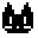

# Ikitomo

- [Installation](#installation)
  - [JAR-File](#jar-file)
  - [Gradle(-Wrapper)](#gradle-wrapper)
  - [Visual Studio Code](#visual-studio-code)
- [Customization](#customization)
  - [Getting Started](#getting-started)
  - [States & Directions](#states--directions)
  - [The Definition](#the-definition)
  - [The Sprites](#the-sprites)
  - [Importing](#importing)
- [Design Decisions](#design-decisions)
  - [Models](#models)
  - [Information Flow](#information-flow)
  - [Behaviors](#behaviors)
  - [Killable](#killable)
- [Notable Pull-Requests](#notable-pull-requests)
- [Branching Model](#branching-model)
- [Contributors](#contributors)

Welcome to **IKITOMO!** The newest discovery in desktop-pet technology! If you've ever felt sad or lonely in recent times, Ikitomo has your back by providing you with adorable desktop pets, **Tomodachis**, that run around on your desktop and follow your mouse. How cute is that?!

By default Ikitomo includes a single Tomodachi, reminiscent of the good ol' classic [*Oneko*](https://en.wikipedia.org/wiki/Neko_(software)) but cleaned up and refreshed for this project. HOWEVER, it gets even better! We, CodeBrewery, have decided to be *extra* generous this time around and we've released a Tomodachi 4-Pack *completely* free of charge for your convenience, no strings attached!

It's hard to believe but it gets *even* better! Ikitomo also ships with the ability to load completely customized Tomodachis right out of the box. So in case you, for some reason unbeknownst to us, get bored of our amazing Tomodachi 4-Pack, you can just create your own from scratch. Amazing, right?!

Well now, what are you waiting for? Get downloading!

...

*Oh and there's some documentation below as well but why read that when you could just download Ikitomo and enjoy life? Anyway, this bit has been going on for way too long. Uh, yeah. Just go ahead. The download instructions are right below. Why are you still reading this?!*

## Installation

Ikitomo can be started in a variety of ways. Pick the one that best fits your needs.

### JAR-File

Most users will want to use our provided JAR-file with the Tomodachi 4-Pack, both of which can be found under our *Releases* page [here](https://github.zhaw.ch/PM2-IT21bWIN-ruiz-mach-krea/team03-codebrewery-projekt2-ikitomo/releases).

Make sure to place the JAR-file in a folder where Java has read- and write-permissions. To actually use external Tomodachis, create a folder titled `tomodachi` and place all your Tomodachis in there. Please make sure that you have Java 17 installed, as that version is needed to run Ikitomo. We recommend the Adoptium releases from the Eclipse Foundation: https://adoptium.net/

If your operating system supports it, you may be able to simply double-click the JAR-file to open it. If that's not an option, you may start Ikitomo with this command:

```shell
$ java -jar [path-to-jar-file]
```

### Gradle(-Wrapper)

Using gradle is likely the easiest option if you're a developer and enjoy hacking on the code. Simply clone or fork-and-clone our repository and open it with your IDE of choice. Well, technically no IDE is required but using one is recommended.

Regardless, simply type the following command to run Ikitomo:

```shell
$ ./gradlew run
```

If you have Gradle installed you might be able to use the `gradle` command as well.

Please do keep in mind that the `tomodachi` folder is located inside `app/`. You might have to adjust your IDE's debug setting to use `app/` as the working directory for Ikitomo to work correctly.

### Visual Studio Code

VS Code users are in luck! We've included a run-and-debug configuration that works nicely with the different working directory. Simply select the *Launch IkitomoMain* configuration and hit F5.

## Customization

As mentioned, Ikitomo provides some customization options: You can create your own Tomodachi. While the process of making one isn't exactly hard, it isn't exactly trivial either.

### Getting Started

The Tomodachi 4-Pack is a great starting point. It contains four Tomodachis that we consider to be "good examples" of complete Tomodachis. A Tomodachi can essentially be broken down into two parts: The definition and the sprites. The definition contains information about the Tomodachi such as a name and icon. It also includes information about the location of animations and when to load them. The sprites are the animations themselves. Ikitomo is designed to receive one spritesheet with metadata per animation. More details are available a little further down.

### States & Directions

Before we get into the actual creation of a Tomodachi, we have to provide some context on how a Tomodachi actually works. Every Tomodachi has six different states and each state may have a direction.

| State | Description                                                                           |
| ----- | ------------------------------------------------------------------------------------- |
| IDLE  | The animation in this state is looped for a random amount of times                    |
| RUN   | The Tomodachi is running in a certain direction                                       |
| SLEEP | Every Tomodachi has configurable chance to fall asleep. They don't move in this state |
| WAKE  | This animation is played right after the SLEEP state ends                             |
| YAWN  | This animation is played right before the SLEEP state starts                          |
| EAT   | When the Tomodachi is clicked, this animation plays                                   |

The directions is currently only ever used for the RUN state.

| Direction  | Example                                              |
| ---------- | ---------------------------------------------------- |
| NONE       | Indicates no directions. Used by all other animation |
| UP         | North                                                |
| UP-RIGHT   | North-East                                           |
| RIGHT      | East                                                 |
| DOWN-RIGHT | South-East                                           |
| DOWN       | South                                                |
| DOWN-LEFT  | South-West                                           |
| LEFT       | West                                                 |
| UP-Left    | North-West                                           |

### The Definition

The definition can be split up into two parts: The header contains the name, id, icon path and default settings of the Tomodachi. The "state" part contains a list of animations for each of the aforementioned states. Please look and one of the definitions from the Tomodachi 4-Pack for a good example on how to structure a definition.

One nifty trick you can use to spice up your Tomodachi's behavior is something we call "animation overloading". Inside each state, you can specify as many animations as you like for the same direction. During runtime, Ikitomo picks a random animation from that list.

**Make sure the definition is titled `_tomodachi.json`**

### The Sprites

Creating the sprites is arguably the hardest part of this process. However, your life will become *much* easier if you use a tool like Aseprite, the open-source sprite editor. Aseprite is very affordable and even free if you decide to compile it yourself from source. We highly recommend it for this step: https://www.aseprite.org/

Keep in mind that Ikitomo currently **only supports sprites 32 by 32 pixels** in size. Spritesheets can be as large as your machine can handle, though.

When exporting your animations we highly recommend you use Aseprite's CLI to automate the process. Internally, we used the following settings:

```bat
@REM Converts all aseprite files in the current directory to a spritesheet with json metadata
setlocal EnableDelayedExpansion
FOR %%f IN ("aseprite/*.aseprite") DO (
    aseprite -b  "aseprite/%%~nf.aseprite" --palette "palettes/classic.aseprite" --sheet "export/classic/%%~nf.png" --sheet-type packed --data "export/classic/%%~nf.json" --format json-array --filename-format {title}_{frame}
    aseprite -b  "aseprite/%%~nf.aseprite" --palette "palettes/strawberry.aseprite" --sheet "export/strawberry/%%~nf.png" --sheet-type packed --data "export/strawberry/%%~nf.json" --format json-array --filename-format {title}_{frame}
    aseprite -b  "aseprite/%%~nf.aseprite" --palette "palettes/negative.aseprite" --sheet "export/negative/%%~nf.png" --sheet-type packed --data "export/negative/%%~nf.json" --format json-array --filename-format {title}_{frame}
)
```

In our case, all source files are contained in the `aseprite` folder and all different palettes are inside the `plattes` folder. The script renders each animation to a spritesheet and some metadata and dumps it all into the `export` folder.

### Importing

To use your Tomodachi, simply copy your folder containing the `_tomodachi.json` file and throw it into the `tomodachi` folder next to your JAR-file.

## Design Decisions

*Also known as the Architecture Documentation*

**TODO: Insert class diagram**

### Models

One of our key design decisions was to have a two-stage model. Classes, like `Settings` or `TomodachiDefinition` are very close to the JSON structure in the file and are used to read and write JSON data to and from the disk. These classes don't load any additional resources, like animations or icons. For that, we implemented the second stage model, `TomodachiModel`. A `TomodachiDefinition` object gets transformed into a `TomodachiModel`. During this transformation, the animations are actually read from the disk and loaded. There are also some additional properties needed by the `OverlayController` which uses the `TomodachiModel`. We've chosen this design to avoid loading all animations at the start of the application, as that would take up a considerable amount time and use an increased amount of memory.

### Information Flow

Another decision with the model is a consequence of how we wanted the settings pane to work. When the user changes a value, they should instantly see the result. Because of this, information needs to flow from the `SettingsController` to the `OverlayController`. This was done using properties and bindings. When a setting is adjusted in the `SettingsController` the `OverlayController` is notified via the binding or property. 

### Behaviors

The behavior of the Tomodachis is implemented in a separate class, `TomodachiBehavior`. It controls the animation and position of the currently displayed Tomodachi and gets recreated every time the user changes the selected Tomodachi. The `TomodachiBehavior` class uses its own model, `BehaviorModel`. It allows the behavior class to modify the animation and position of the Tomodachi. It communicates with the other classes via properties, bindings and some listener/callbacks. We created the model in the first place, instead of using the `TomodachiModel`, to reduce the interface between the `TomodachiBehavior` and the `OverlayController`. This makes it a lot easier to mock test the behavior as there is less API surface to mock.

Another decision in the design was how and where to program the behavior of the Tomodachis. As mentioned above, `TomodachiBehavior` is responsible for this. It has three public methods that are called by the `OverlayController`: `update(double delta)`, `animationFinished(StateType oldState)` and `tomodachiWasClicked()`. Two of those methods tell the `TomodachiBehavior` class when an animation finished and when the Tomodachi was clicked. `update(...)` is called every JavaFX pulse and is used to animate the position and to change states, when, for example, the mouse moves too far away from the Tomodachi. This design is quite flexible, as the `TomodachiBehavior` can implement almost every possible behavior. The only limitation is that the behavior class can only change the position and the animation of the Tomodachi. We considered implementing a generic state machine and defining a behavior of a Tomodachi with how the state machine would be initialized. However, due to time constraints and an increase in complexity of Ikitomo, this feature would have been more limiting than our current solution and was ultimately cut.

The `TomodachiBehavior` uses a strategy interface named `NextPositionStrategy` to get the next target position of the Tomodachi. This position is polled while the Tomodachi is in the `RUN` state, and it will move towards it. This would allow us to implement multiple behaviors, like following the mouse or the current active window are moving to a random position.

### Killable

Every controller implements an interface named, `Killable` which has one method `CompletableFuture<Void> kill()`. This is used to close the application and disposing all resources of every controller. Because of this, we can dispose the tray icon and swing frames quite elegantly.

## Notable Pull-Requests

The following pull requests represent our typical PRs:

1. Add Classes for Serializing Settings [#18](https://github.zhaw.ch/PM2-IT21bWIN-ruiz-mach-krea/team03-codebrewery-projekt2-ikitomo/pull/18)
2. Add log configuration [#21](https://github.zhaw.ch/PM2-IT21bWIN-ruiz-mach-krea/team03-codebrewery-projekt2-ikitomo/pull/21)

## Branching Model

Our default branch is `main`. All changes have to be made via a pull request after the initial commits. For every task, there is an issue. If somebody starts working on an issue, they're assigned to that issue and must create a branch for all changes. The branch name has to be a brief description of the issue that it fixes plus a prefix containing the issue number. For information on how to write commit messages, we recommend the clean code book. A pull request has to be linked to an issue. This can either be done through mentioning the issue number in the commit message or by setting it manually on the web GUI. A branch may only be merged into `main` if a pull request exists and has been approved by at least one other person.

## Contributors

This project is only possible thanks to these superb people:

|                    |
| ------------------ |
| Manuel Thalmann    |
| Michael Ziegler    |
| Sebastian Zumbrunn |
| Jonas Costa        |